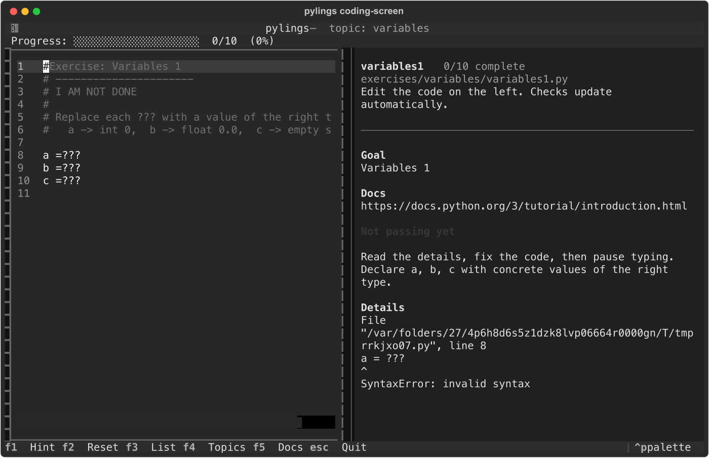
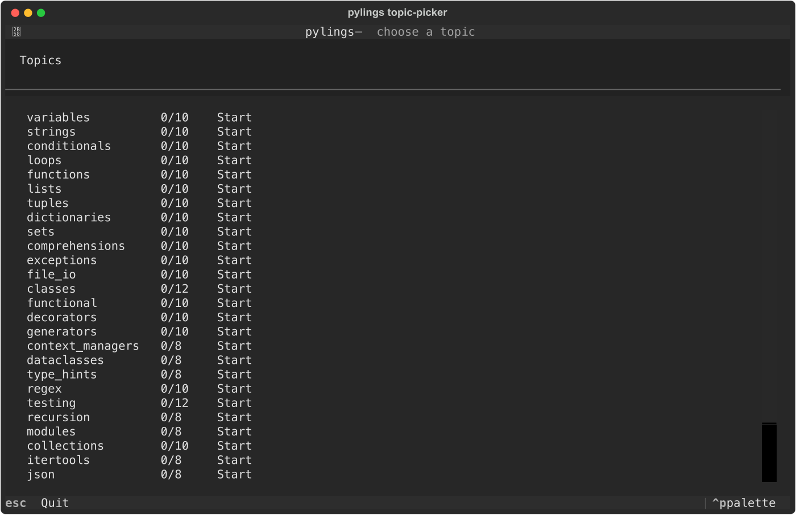
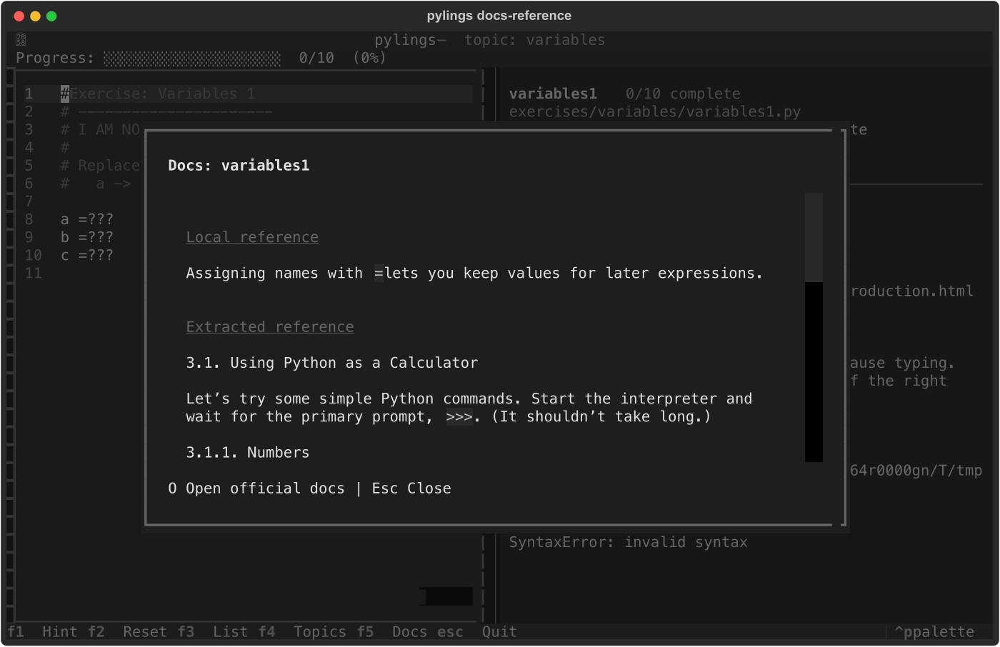

# Pylings

[](https://www.python.org/)
[](https://semver.org/)
[](https://semver.org/)
[](#development)
[](LICENSE)

Pylings is a Rustlings-style learning environment for Python. It ships broken
exercises, hidden checks, a live Textual editor, progressive hints, and bundled
Python documentation snippets so learners can work without leaving the terminal.



## Highlights

- 292 exercises across 31 Python topics, from variables through async.
- Live in-terminal editor with automatic checks after edits.
- Topic picker with progress, resume state, reset, hints, and one-shot CLI runs.
- `F5` opens a local Python reference window; `O` opens the official docs page.
- Bundled docs are generated from the official Python documentation for offline use.

## Install

```bash
pipx install pylings
```

For local development:

```bash
git clone git@github.com:abhiksark/pylings.git
cd pylings
pip install -e ".[dev]"
```

## Quick Start

```bash
pylings                         # open the TUI on the first pending exercise
pylings topics                  # open the topic picker
pylings list                    # show topic progress
pylings hint variables1         # print a hint and docs link
pylings run variables1          # run one exercise check
pylings reset variables1 --yes  # restore an exercise from its snapshot
pylings verify                  # run every exercise check
```

Each exercise contains a `# I AM NOT DONE` marker. Fix the code, remove the
marker, and let the live check advance you to the next exercise.

## Interface



| Key | Action |
|---|---|
| `F1` | Toggle hint |
| `F2` | Reset the current exercise |
| `F3` | Toggle the exercise list |
| `F4` | Return to the topic picker |
| `F5` | Show the local Python reference |
| `O` | Open official docs from the reference window |
| `Esc` | Close docs, or quit from main screens |
| `Ctrl+Q` | Quit |



## Project Layout

```text
pylings/                 # application package
  core/                  # manifest, state, runner, reset, docs loading
  screens/               # Textual screens
  widgets/               # reusable TUI widgets
  docs/                  # bundled Python documentation snippets
exercises/<topic>/       # learner-editable exercise files
checks/<topic>/          # hidden assertions for each exercise
tests/                   # unit, integration, and TUI tests
scripts/fetch_python_docs.py
info.toml                # curriculum order, hints, and docs URLs
```

Regenerate the local reference snippets with:

```bash
python scripts/fetch_python_docs.py
```

## Development

```bash
pip install -e ".[dev]"
python -m pytest -q
pylings --root tests/fixtures/passing_curriculum verify
```

When adding curriculum, update `exercises/`, `checks/`, and `info.toml`
together. Keep exercise and check filenames mirrored, for example
`exercises/lists/lists3.py` and `checks/lists/lists3.py`.

## Release Flow

Pylings uses Semantic Versioning:

- `MAJOR`: incompatible curriculum or CLI changes.
- `MINOR`: new topics, exercises, TUI features, or docs workflows.
- `PATCH`: fixes, copy edits, and compatible test or packaging updates.

Branch flow is feature-first:

```text
feature/<name> -> dev -> main -> vMAJOR.MINOR
```

Feature branches are merged into `dev`. A verified `dev` branch is then merged
into `main` and tagged with an annotated release tag such as `v0.1`.

## Attribution

Pylings is inspired by [rustlings](https://github.com/rust-lang/rustlings).
Bundled reference snippets are generated from the official Python documentation.
See [pylings/docs/NOTICE.md](pylings/docs/NOTICE.md) for Python documentation
licensing details.

## License

MIT. See [LICENSE](LICENSE).
